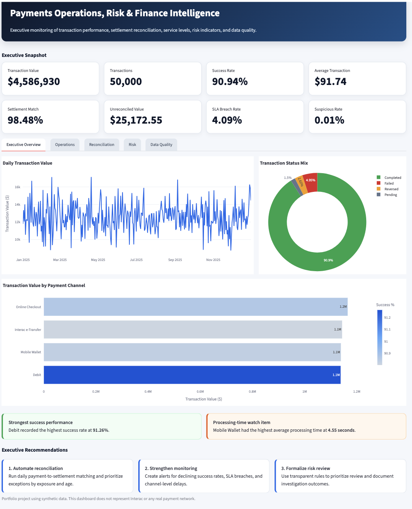
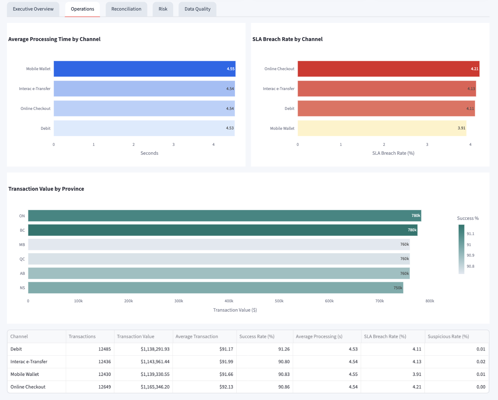
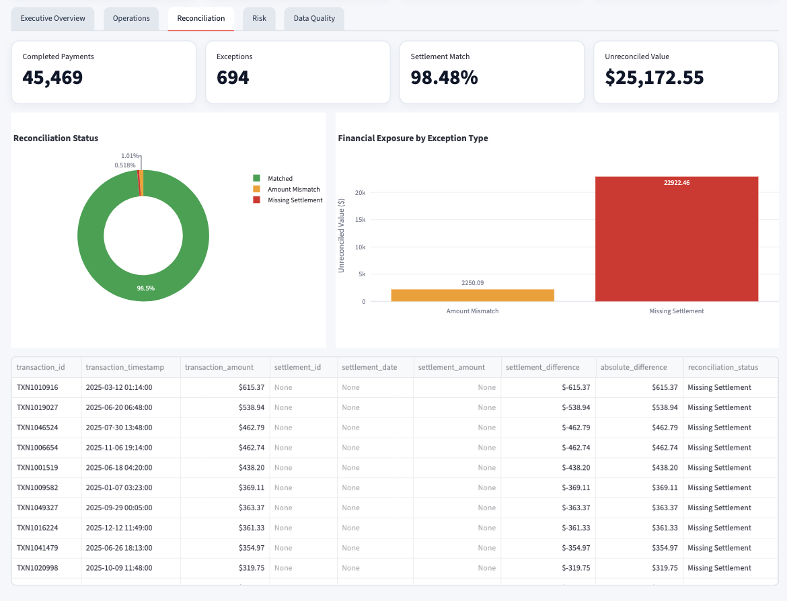
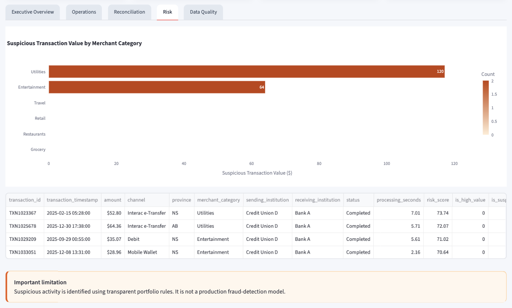

# Payments Operations, Risk & Finance Intelligence Platform

An end-to-end business intelligence and finance transformation project using Python, SQL, DuckDB, Streamlit, and synthetic payments data.

## Live Dashboard

Add Streamlit link here after deployment.

## Project Overview

This project simulates a digital-payments environment and develops an automated management reporting solution for Finance, Operations, Risk, Product, and executive stakeholders.

The platform monitors transaction performance, settlement reconciliation, service-level compliance, suspicious transaction indicators, and data-quality issues.

## Business Problem

A digital-payments organization processes high transaction volumes across multiple payment channels, financial institutions, merchant categories, and Canadian provinces.

Management needs standardized visibility into:

* Transaction value and volume
* Payment success and failure rates
* Processing time and SLA performance
* Settlement matching
* Missing and mismatched settlement records
* Suspicious transaction indicators
* Data-quality exceptions
* Channel and regional performance

## Solution

The project:

1. Generates synthetic transaction and settlement data
2. Loads the data into DuckDB
3. Applies SQL data-quality controls
4. Reconciles payments against settlement records
5. Calculates financial, operational, and risk KPIs
6. Exports analytical results
7. Presents results through an interactive Streamlit dashboard
8. Documents business requirements, assumptions, and recommendations

## Dashboard Preview










## Key Findings

* Analyzed 50,000 transactions with a total value of approximately $4.59 million
* Achieved a simulated payment success rate of 90.94%
* Identified a 98.48% settlement match rate
* Detected approximately $25,172.55 in unreconciled value requiring investigation
* Identified 236 completed transactions without settlement records
* Detected 90 duplicate settlement IDs
* Online Checkout generated the highest transaction value
* Debit recorded the highest payment success rate
* Overall suspicious activity remained low at approximately 0.01%

## Business Recommendations

* Automate daily transaction-to-settlement reconciliation
* Prioritize exceptions by financial value and age
* Establish alerts for settlement-match and SLA deterioration
* Investigate channels with elevated failure or processing times
* Standardize transaction and settlement status definitions
* Formalize an exception-management workflow
* Monitor data-quality controls through recurring management reporting

## Tools

* Python
* pandas
* NumPy
* SQL
* DuckDB
* Streamlit
* Plotly
* VS Code
* GitHub

## Project Documentation

* [Executive Summary](docs/executive_summary.md)
* [Business Requirements](docs/business_requirements.md)
* [Data Dictionary](docs/data_dictionary.md)
* [Process Map](docs/process_map.png)

## Run Locally

```bash
python3 -m venv .venv
source .venv/bin/activate
pip install -r requirements.txt
python generate_data.py
python build_database.py
python analysis.py
python -m streamlit run app.py
```

## Important Limitations

* The project uses synthetic data
* It does not represent Interac or any real payment network
* Suspicious transaction flags are rule-based
* Unreconciled value is not automatically a confirmed financial loss
* The payment and settlement processes are simplified for portfolio purposes

## Author

Wanlin Song


